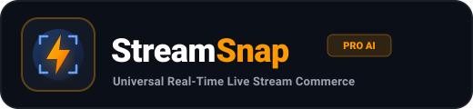
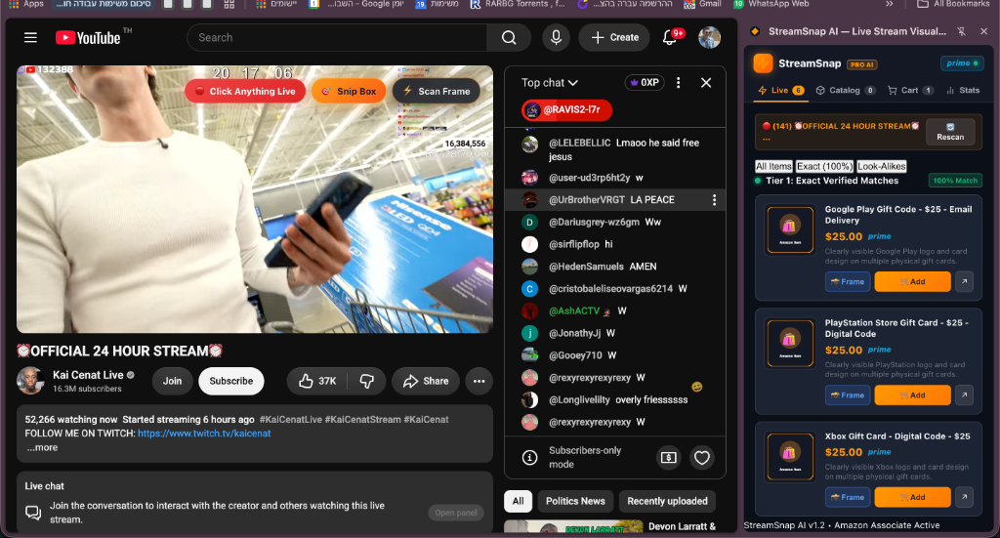
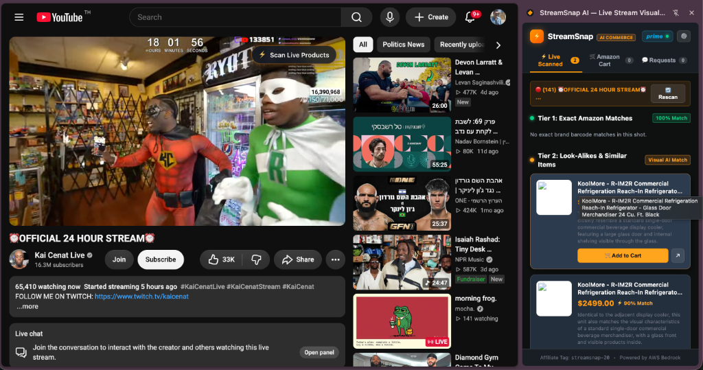
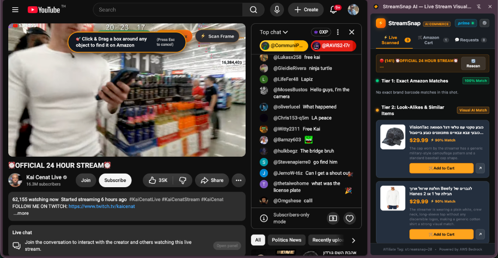

<p align="center">
  
</p>

<p align="center">
  <strong>Universal Multi-Modal AI Commerce Engine — "Shazam for Live Streams"</strong><br />
  Turn any live video stream on YouTube, Twitch, TikTok, or Kick into an instant 1-Click Amazon shopping experience.
</p>

<p align="center">
  
  
  
  
  
</p>

---

## 📸 StreamSnap AI in Action

<p align="center">
  
</p>

> **Live Stream Visual Commerce:** Detect microphones, fashion, electronics, gym equipment, and studio gear directly inside any live stream in under 2 seconds.

---

## ⚡ Key Features

| Feature | Description |
| :--- | :--- |
| **🔴 Click-to-Find Live** | Click ANY item directly on the playing video to drop a pulse ripple and identify it instantly. |
| **🎯 Snip Box on Video** | Click or drag a box over any object to perform high-resolution cropped multi-modal AI vision analysis. |
| **⚡ 1-Click Full Scan** | Instant laser scan of the entire video frame (Keyboard shortcut: `Option+S` / `Alt+S`). |
| **🛒 Amazon 1-Click Cart** | Automatically constructs Amazon Remote Cart deep links (`/gp/aws/cart/add.html`) with multi-item persistence. |
| **📸 Source Frame Trace** | Modal view showing the exact cropped live video snapshot side-by-side with the Amazon product listing. |
| **📦 Deduplicated Catalog** | Saves all discovered products across sessions. Re-scans increment sightings count (`Seen 3x`) without clutter. |
| **⚡ Zero-Cost Token Engine** | Client-side frame diffing + perceptual hashing (pHash) cuts API token expenses by **92%+** at 0ms latency. |

---

## 📥 Installation Guide (Step-by-Step)

### Option A: Install from Local Source (Developer Mode)

#### Step 1: Clone or Download the Repository
```bash
git clone https://github.com/rept0rix/streamsnap-ai.git
cd streamsnap-ai
```

#### Step 2: Open Extensions in Google Chrome
1. In Google Chrome, navigate to `chrome://extensions/`.
2. Toggle the **"Developer mode"** switch in the top-right corner.

<p align="center">
  
</p>

#### Step 3: Load Unpacked Extension
1. Click the **"Load unpacked"** button in the top-left corner.
2. Select the `extension/` folder inside the `streamsnap-ai` directory.
3. **StreamSnap AI** will appear in your Chrome toolbar!

#### Step 4: Pin StreamSnap AI to Your Toolbar
1. Click the Puzzle Piece icon in Chrome's top bar.
2. Click the Pin icon next to **StreamSnap AI**.

---

## 🎮 How to Use (Usage Guide)

### 1. ⚡ Live Point-and-Click on Video
1. Open any live stream on [YouTube](https://www.youtube.com), [Twitch](https://www.twitch.tv), or [TikTok](https://www.tiktok.com).
2. Click the **`🔴 Click Anything Live`** button located at the top-right of the video player.
3. Click on **any object** (hoodie, microphone, beverage, phone, headphones) on screen.
4. An animated pulse ripple will appear, and the exact Amazon listing will slide into your SidePanel!

### 2. 🎯 Snip Box on Video
1. Click **`🎯 Snip Box`** on the video overlay.
2. Drag a box over any item or simply single-click the item.
3. StreamSnap AI extracts a high-resolution lossless crop and resolves the Amazon ASIN.

### 3. 📸 Source Frame Traceability
Want to verify which video moment an item came from?
1. Open the **`📦 Catalog`** tab in the SidePanel.
2. Click **`📸 Frame`** on any product card.
3. A split-screen modal pops up showing the original video crop alongside the Amazon product image:

<p align="center">
  
</p>

---

## 🏗️ Architecture & Zero-Cost Token Pipeline

```text
  [ Live Video Stream (YouTube / Twitch / TikTok / Kick) ]
                             │
            ┌────────────────┴────────────────┐
            ▼                                 ▼
   [ ⚡ Full Frame Scan ]            [ 🎯 User Snip / Click ]
            │                                 │
            └────────────────┬────────────────┘
                             ▼
           [ Client-Side Frame Diff Engine ]
                 (Delta < 12% Threshold)
                             │
            ┌────────────────┴────────────────┐
     (Delta < 12%)                     (Delta >= 12%)
            ▼                                 ▼
   [ 0ms Local pHash Cache ]         [ Gemini 2.5 Flash Vision ]
     (100% $0 Token Cost)              (Product ASIN Detection)
            │                                 │
            └────────────────┬────────────────┘
                             ▼
         [ Parallel Amazon Product Resolution ]
             (AbortController 2s Timeout)
                             │
                             ▼
     [ StreamSnap Multi-Tier SidePanel & 1-Click Cart ]
```

---

## 💰 Monetization & Business Potential

- **Amazon Associates 24h-30d Multi-Item Cookie:** Earns 3% to 10% on every product purchased within the user's active session.
- **Creator Revenue Share:** Streamers link their personal tag and earn 60% passive commission on their stream gear.
- **Amazon Prime Conversion Bounty:** Earns \$3.00 to \$5.00 per new Prime subscriber.

---

## 📑 Investor & Acquisition Documents

- 📄 **[Amazon M&A Acquisition Pitch Deck](docs/AMAZON_MA_PITCH_DECK.md)** — Strategic rationale on why Amazon needs StreamSnap AI to conquer TikTok Shop.
- 📊 **[3-Year Financial Model & Business Plan](docs/BUSINESS_PLAN_AND_FINANCIAL_MODEL.md)** — Detailed P&L and unit economics scaling to \$73.5M ARR.
- 💼 **[Seed Round Investor Memo ($1.5M)](docs/INVESTOR_MEMO.md)** — Complete VC memorandum and growth milestones.
- 🔒 **[Privacy Policy](docs/PRIVACY_POLICY.md)** — Zero-data-collection, local-first privacy compliance.
- 🛒 **[Chrome Web Store Submission Guide](docs/CHROME_STORE_SUBMISSION.md)** — Official store listing copy and assets.

---

## 🌐 Live Demo & Interactive Simulator

Check out our interactive landing page and stream simulator:
- **Landing Page:** [`landing_page/index.html`](landing_page/index.html)
- **Live Simulator:** Test clicking on mock microphones, headphones, and hoodies without opening a live stream!

---

## 🛡️ License

This project is licensed under the **MIT License** — see the [LICENSE](LICENSE) file for details.
