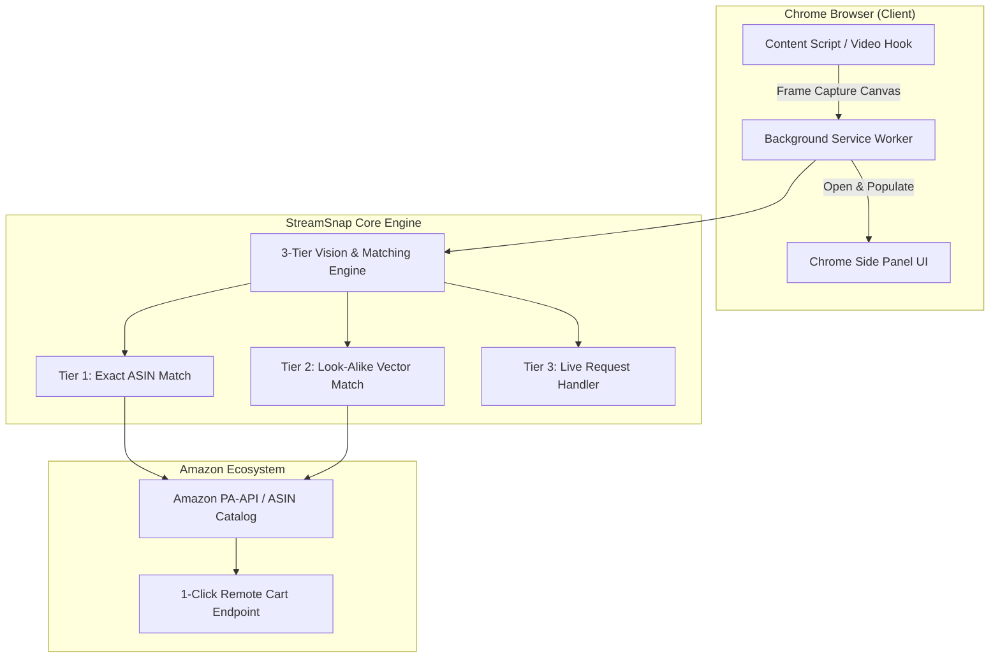

# Product Requirements Document (PRD)
# StreamSnap AI — Universal Live Stream Visual Commerce

**Document Version:** 1.0.0  
**Status:** Approved / In Implementation  
**Target Release:** Chrome Extension MVP (Manifest V3)  

---

## 1. מבוא ומטרות המוצר (Introduction & Goals)

### 1.1 חזון המוצר
**StreamSnap AI** מאפשר לכל צופה בשידורי לייב (YouTube, TikTok, Twitch, Facebook Live, Kick) לזהות כל מוצר, בגד או ציוד שמופיע בשידור בלחיצת כפתור אחת, ולבצע הוספה מיידית לעגלת הקניות באמזון (1-Click Amazon Cart) ללא צורך בעזיבת השידור.

### 1.2 יעדים מרכזיים (Key Objectives)
* **אוניברסליות:** תמיכה בכל אתר סטרימינג מבוסס HTML5 `<video>` ללא צורך בהתאמה מיוחדת לכל אתר.
* **אפס חיכוך (Zero Friction):** זיהוי תוך פחות מ-1.5 שניות, הצגת כרטיסי מוצר בסרגל צדי (Side Panel) מבלי להסתיר את הווידאו.
* **מענה לכל תרחיש (3-Tier Engine):** פתרון למוצרים מדויקים (Exact), מוצרים דומים (Look-alikes), ומוצרים שלא זוהו (Live Request).
* **מוכנות לאמזון (Amazon-Ready Architecture):** תמיכה מלאה במבנה נתוני ASIN, מזהי Affiliate של אמזון ו-1-Click Cart URLs.

---

## 2. קהלי יעד ותרחישי שימוש (User Personas & Use Cases)

| פרסונה | צורך מרכזי | פעולה במערכת |
| :--- | :--- | :--- |
| **הצופה הסקרן (Viewer)** | רואה גאדג'ט/בגד אצל סטרימר ורוצה לדעת כמה זה עולה ומאיפה לקנות. | לוחץ על כפתור "Scan" על גבי הנגן ➔ מקבל תוצאות באמזון בסרגל הצדי ➔ לוחץ "Add to Cart". |
| **חובב האופנה (Fashion Hunter)** | רואה פריט לבוש ללא מותג גלוי. | סורק את הפריט ➔ מקבל 3 חלופות דומות ומדורגות מאמזון (Look-alikes) או שולח "בקשת איתור". |
| **הסטרימר / יוצר התוכן (Creator)** | רוצה להרוויח כסף מציוד שמופיע בשידור בלי להתעסק בהזנת קישורים ידנית. | מקבל התראות על מוצרים שצופים מחפשים או מרוויח עמלת שותפים מחולקת. |

---

## 3. דרישות פונקציונליות מפורטות (Functional Requirements)

### 3.1 מודול זיהוי ותפיסת וידאו (Universal Video Capture Engine)
* **FR-1.1:** סקריפט התוכן (Content Script) יזהה אוטומטית אלמנט `<video>` פעיל בכל אתר נתמך (YouTube, Twitch, TikTok, Facebook).
* **FR-1.2:** התוסף יוסיף כפתור צף מודרני ("Scan Live Products ⚡") בפינת הנגן או יאפשר קיצור מקלדת (`Alt+S`).
* **FR-1.3:** בעת לחיצה, המערכת תבצע לכידת פריים ברזולוציה מלאה באמצעות `<canvas>` מקומי ותעביר אותו למנוע הזיהוי.

### 3.2 מנוע הזיהוי התלת-שכבתי (3-Tier Recognition Pipeline)
* **FR-2.1 (שכבה 1 - זיהוי מדויק):**
  * זיהוי מוצרים מובהקים (ציוד סטודיו, מיקרופונים, אוזניות, מחשבים, בקבוקים, גאדג'טים).
  * שליפת שם דגם מלא, מחיר מדויק באמזון, תג Prime, דירוג כוכבים, ו-ASIN.
* **FR-2.2 (שכבה 2 - חלופות דומות Look-Alikes):**
  * בעת זיהוי פריטי אופנה/עיצוב ללא מותג ספציפי, המערכת תציג תג "Similar Items" עם 3 התאמות ויזואליות מדורגות מאמזון.
* **FR-2.3 (שכבה 3 - מנגנון בקשת איתור Live Request):**
  * אפשרות לצופה לסמן פריט שלא זוהה ולשלוח "בקשת איתור".
  * יצירת התראה חכמה לצ'אט/לסטרימר לקבלת קישור.

### 3.3 ממשק משתמש בסרגל צדי (Chrome SidePanel UI)
* **FR-3.1:** פתיחה מיידית של הסרגל הצדי (`chrome.sidePanel`) בלחיצה על כפתור הסריקה.
* **FR-3.2:** כרטיסיות מוצר עשירות עם:
  * תמונת מוצר באיכות גבוהה.
  * כותרת ומחיר עדכני.
  * באדג' רמת ודאות (Exact Match 🟢 / Look-Alike 🟡).
  * כפתור **"🛒 Add to Amazon Cart"** שמבצע פעולה ישירה ללא יציאה מהשידור.
* **FR-3.3:** טאבים ייעודיים:
  * 🎯 **Scanned Live:** מוצרים שנמצאו בפריים הנוכחי.
  * 🛍️ **My Cart:** פריטים שנוספו לעגלה במהלך השידור.
  * ❓ **Requests:** בקשות איתור שנשלחו.

---

## 4. ארכיטקטורה טכנולוגית (Technical Architecture)

---

## 5. תוכנית בדיקות והדגמה (Demo & Verification Plan)

1. **דף הדגמה מובנה (Interactive Demo Testbed):**
   * יצירת עמוד בדיקה מקומי שמציג סימולציה של שידורי לייב אמיתיים (יוטיוב, טוויץ', טיקטוק) לבדיקה מהירה של כל היכולות בלחיצה אחת.
2. **בדיקת תוסף חיה ביוטיוב/טוויץ':**
   * טעינת התוסף בדפדפן כרום במצב מפתח (Developer Mode).
   * פתיחת שידור לייב אמיתי ב-YouTube/Twitch ולחיצה על Scan.
   * אימות פתיחת ה-SidePanel והצגת המוצרים, המחירים וכפתורי הרכישה באמזון.
