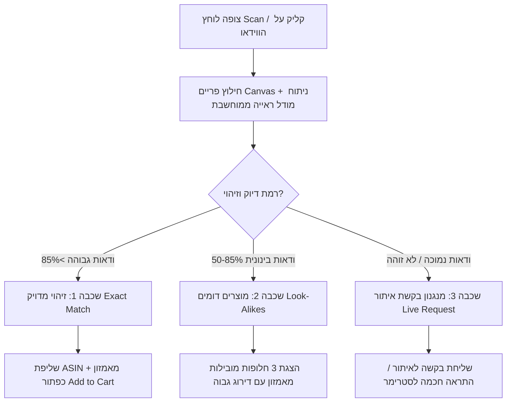

# StreamSnap AI (Live Stream Visual Commerce)
## מסמך אפיון מוצר, ארכיטקטורה עסקית וטכנולוגית (Product Specification & Master Plan)

---

## 1. תקציר מנהלים וחזון (Executive Summary & Vision)

**StreamSnap AI** הוא מנוע מסחר ויזואלי בזמן אמת (Real-time Visual Commerce) שפועל כשכבת-על (Universal Overlay) על כל שידור חי באינטרנט.

* **החזון:** להפוך כל פריים בווידאו חי – ב-**YouTube, TikTok, Facebook Live, Twitch, Instagram Web ו-Kick** – להזדמנות רכישה מיידית בלחיצת כפתור אחת (1-Click Buy), תוך חיבור ישיר לקטלוג ולמערכות הרכישה של **Amazon**.
* **הסלוגן:** *"Shazam for Live Streams — If you can see it, you can buy it on Amazon."*
* **שלב ראשון (Demo / MVP):** תוסף דפדפן (Chrome Extension) אוניברסלי שרץ על כל אתרי הווידאו, מזהה מוצרים בלייב ומאפשר הוספה ישירה לעגלת הקניות באמזון.

---

## 2. הבעיה וההזדמנות בשוק (The Market Opportunity)

```
[ הצופה רואה פריט בשידור חי ]
              │
    ┌─────────┴─────────┐
    ▼                   ▼
[ הדרך הישנה (חיכוך גבוה) ]      [ StreamSnap AI (אפס חיכוך) ]
 1. שואל בצ'אט "מאיפה ה-X?"       1. לוחץ על הפריט במסך
 2. מחכה לתשובה שלא מגיעה         2. זיהוי AI מיידי (תוך שניות)
 3. עובר לחפש ידנית בגוגל         3. הוספה בלחיצה אחת לעגלת אמזון
 4. 90%+ נוטשים בלי לקנות!        4. השלמת רכישה בלי לעזוב את השידור
```

### הכאבים המרכזיים:
1. **חוסר יכולת לזהות פריטים ספונטניים:** פלטפורמות כמו TikTok Shop ו-Amazon Live מחייבות את היוצר להזין מוצרים מראש לקטלוג. אם הסטרימר לובש משהו שלא תוייג מראש – אין דרך לקנות אותו.
2. **שוק ה-Live Commerce במערב מפגר:** בזמן שבסין שוק ה-Live Commerce מגלגל מאות מיליארדי דולרים, במערב (YouTube, Facebook, Twitch) חוויית הרכישה עדיין מבוססת על קישורי טקסט מיושנים בתיאור הסרטון.
3. **הפוטנציאל הלא ממומש של אמזון ב-Twitch:** אמזון מחזיקה ב-Twitch (עשרות מיליוני צופים ביום) אך מתקשה לחבר בין צופי הגיימינג והטכנולוגיה לקטלוג הקניות העצום שלה.

---

## 3. ארכיטקטורת זיהוי תלת-שכבתית (The 3-Tier Recognition Engine)

כדי לפתור את בעיית אי-הוודאות בזיהוי ויזואלי של פריטים בשידור חי, המערכת בנויה על מודל מדורג:



### פירוט השכבות:
* **שכבה 1 – זיהוי מדויק (Exact ASIN Match):**
  * מיועד לפריטים עם מאפיינים ברורים: גאדג'טים, מיקרופונים, אוזניות, מחשבים, בקבוקי שתייה ממותגים, ספרים (זיהוי OCR של כותרות).
  * התוצאה: כרטיס מוצר מדויק עם מחיר עדכני, תג Prime וכפתור קנייה ישיר.
* **שכבה 2 – חלופות דומות (Look-Alikes & Substitutes):**
  * מיועד לפריטי אופנה ללא לוגו, רהיטים, תאורות רקע ואקססוריז.
  * המערכת מחלצת מאפיינים ויזואליים (סגנון, צבע, טקסטורה, גזרה) ומבצעת חיפוש וקטורי בקטלוג אמזון.
  * התוצאה: *"לא מצאנו את המותג הספציפי, אבל הנה 3 פריטים כמעט זהים עם דירוג 4.5+ כוכבים באמזון"*.
* **שכבה 3 – בקשת איתור קהילתית/לייב (Live Product Request & Bounty):**
  * אם הפריט נדיר, מותאם אישית או מוסתר חלקית:
    1. **סריקת עומק ברקע (Async Deep Search):** ניתוח רב-שכבתי של פריימים קודמים וטקסט מהצ'אט.
    2. **פינג ליוצר / לצ'אט:** אם מספר צופים מתעניינים בפריט, קופצת לסטרימר התראה: *"5 צופים שואלים על השעון שלך – לחץ להדבקת קישור וקבלת עמלת מכירה מיידית"*.

---

## 4. תמיכה רב-פלטפורמית (Universal Cross-Platform Coverage)

התוסף פועל כשכבה אוניברסלית מעל תגית ה-HTML5 `<video>` בכל אתר סטרימינג מוביל:

| פלטפורמה | סוגי תוכן עיקריים | קטגוריות מוצרים מובילות לזיהוי |
| :--- | :--- | :--- |
| **YouTube Live** | Tech Reviews, Podcasts, Gaming, Talk Shows | מיקרופונים, מצלמות, ספרי קריאה, ציוד מחשב, ביגוד |
| **TikTok Web (Live)** | Lifestyle, Fashion, Beauty, Gadgets | איפור, תכשיטים, פריטי אופנה, תאורות רינג, חטיפים |
| **Facebook Live** | Community Sellers, Local Streams, Events | כלי בית, פריטי אספנות, גאדג'טים לבית |
| **Twitch / Kick** | Gaming, Esports, Just Chatting | כיסאות גיימינג, אוזניות, בקרים, תאורת RGB, משקאות אנרגיה |

---

## 5. החיבור הישיר לאקוסיסטם של אמזון (Amazon Integration & Monetization)

```
[ מנוע ה-AI ] 
      │
      ▼
┌────────────────────────────────────────────────────────┐
│                   Amazon Ecosystem API                 │
├────────────────────────────────────────────────────────┤
│ 1. PA-API v5: שליפת מחירים, מלאי, דירוג ותמונות בלייב   │
│ 2. Remote Cart API: הוספה ישירה לעגלת ה-Amazon של המשתמש│
│ 3. Amazon Associates Tag: הזרקת מזהה שותפים לכל פעולה │
│ 4. AWS Cloud (Bedrock / Rekognition): ריצה בתשתית אמזון│
└────────────────────────────────────────────────────────┘
```

### מודל ההכנסות (Monetization Model):
1. **עמלות שותפים (Affiliate Commissions):** 1% עד 10% מכל רכישה ישירה או עקיפה שמתבצעת באמזון (חלון 24 שעות מהקלקת המוצר).
2. **מודל חלוקת רווחים עם יוצרים (Creator Rev-Share):** חלוקת אחוזים עם סטרימרים שמשתפים פעולה, מה שמניע אותם לעודד את הקהל להתקין את התוסף.
3. **מיקומים ממומנים (Sponsored Substitutes):** מותגים יוכלו לשלם כדי להופיע כ"מוצר דומה מומלץ" בעת זיהוי מוצר של מתחרה.

---

## 6. תוכנית פעולה להדגמה ו-MVP (Proof of Concept Roadmap)

### שלב א': אב-טיפוס של תוסף כרום (Chrome Extension Demo)
1. **Content Script:** זיהוי אוטומטי של נגן הווידאו הפעיל בכל טאב (YouTube / TikTok / Twitch / Facebook).
2. **Capture Mechanism:** כפתור ריחוף "Scan Frame" או לחיצה על אזור ספציפי בווידאו.
3. **AI Vision Pipeline:** שליחת הפריים ל-API רב-מודאלי (Multi-modal Vision LLM) לזיהוי אובייקטים וסיווג.
4. **Amazon PA-API Matcher:** המרת האובייקט לתוצאת אמזון עם ASIN, מחיר וקישור 1-Click Cart.
5. **Side Panel UI:** פתיחת סרגל צד נקי (Chrome SidePanel) שמציג את רשימת המוצרים שנלכדו בלי להסתיר את השידור.

### שלב ב': הוכחת היתכנות ומדדים (Traction Metrics)
* **דיוק זיהוי (Precision):** מעל 85% דיוק במוצרי אלקטרוניקה, סטודיו וציוד מוכר.
* **זמן תגובה (Latency):** פחות מ-1.5 שניות מלחיצת הסריקה ועד להצגת כרטיסי המוצר.
* **GMV & Clicks:** מעקב אחרי כמות הקלקות על מוצרים והוספות לעגלת הקניות באמזון.

---

## 7. אסטרטגיית המכירה לאמזון (Target: Acquired by Amazon)

### הסיפור העסקי (The Narrative for Amazon M&A):
* **הפער שאמזון לא הצליחה לסגור:** אמזון השקיעה מיליארדים ברכישת Twitch ובפיתוח שירותי AI כמו Rufus ו-Lens, אך לא הצליחה להפוך את זרם הווידאו החי לחנות פעילה.
* **הפתרון שלנו:** אנחנו השכבה החסרה. הטכנולוגיה נבנתה במיוחד כדי להתחבר ל-PA-API, AWS ו-Twitch, וניתנת להטמעה כשירות מובנה בתוך שבועות ספורים.
* **הגנה מול TikTok Shop:** מתן מענה תחרותי מוחץ שמחזיר את כוח הקנייה הצעיר לאמזון מכל הרשתות החברתיות.
